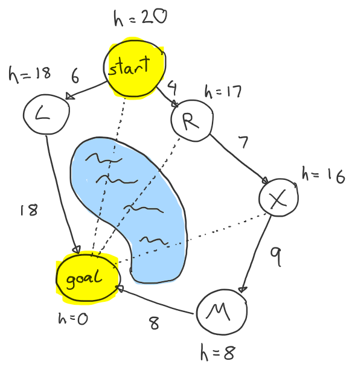

# A* (Star) Search Algorithm

Implements the A* Search Algorithm.

A* is a graph algorithm that aims to find a path from a start node to a goal node.
It does this using a combination of known cost and heuristics. A heuristic is a guess of the cost of a choice that
we can make. Heuristics are associated with nodes, not edges. Nodes represent the state, edges are just
a way of changing state. The heuristic can be anything, there is no set rule as to what it must be.
It should, however, be a good approximation of the true cost to the goal. The heuristic is allowed to
underestimate the true cost but should not overestimate.

A* combines the known cost of going from the start node to our current node with the heuristic cost
of going from our current node to the goal node.

We start our search at the start node and keep exploring other nodes until we discover that we are at the
goal node. The next node we explore is always the one with the lowest estimates total cost to the goal.
The total estimated cost to the goal is the cost of going from the start node to our current node plus the heuristic
cost
of going from our current node to the goal node.

Once we visit a node, we do not visit it again.

A-Star is optimal (finds the cheapest path to the goal) if the heuristic used is consistent.
Consistent: for each edge the heuristic cannot drop more than the edge weight.

---

We maintain three data structures:

- The main one is the **frontier**, it is a ordered vector. Order is maintained on insertion. We must also be able to
  update existing items in the frontier.
- A set of all nodes that we have **visited**. We never visit/explore the same node twice.
- Map of **node to** their **parent node**. Used to building the final path.

---

### Example

Initially we start with only the start node in the frontier.

Frontier

| Node | known cost to here | heuristic cost to goal | estimated total cost |
|------|--------------------|------------------------|----------------------|
| S    | 0                  | 20                     | 20                   |

Visited

|   |
|---|

Node to parent

| Node | Parent |
|------|--------|
|      |        |

At each iteration of the algorithm we take from the frontier the node that has the lowest estimated total cost to goal
