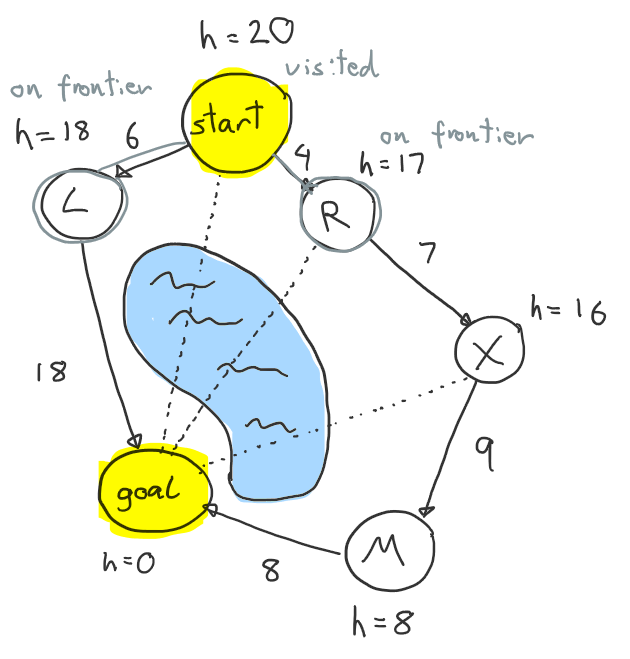

# A* (Star) Search Algorithm

Implements the A* Search Algorithm.

A* is a graph algorithm that aims to find a path from a start node to a goal node.
It does this using a combination of known cost and heuristics. A heuristic is a guess of the cost of a choice that
we can make. Heuristics are associated with nodes, not edges. Nodes represent the state, edges are just
a way of changing state. The heuristic can be anything, there is no set rule as to what it must be.
It should, however, be a good approximation of the true cost to the goal. The heuristic is allowed to
underestimate the true cost but should not overestimate.

A* combines the known cost of going from the start node to our current node with the heuristic cost
of going from our current node to the goal node.

We start our search at the start node and keep exploring other nodes until we discover that we are at the
goal node. The next node we explore is always the one with the lowest estimates total cost to the goal.
The total estimated cost to the goal is the cost of going from the start node to our current node plus the heuristic
cost
of going from our current node to the goal node.

Once we visit a node, we do not visit it again.

A-Star is optimal (finds the cheapest path to the goal) if the heuristic used is consistent.
Consistent: for each edge the heuristic cannot drop more than the edge weight.

---

We maintain three data structures:

- The main one is the **frontier**, it is an ordered vector. Order is maintained on insertion. We must also be able to
  update existing items in the frontier. The node to be explored next is **last** in the frontier.
- A set of all nodes that we have **visited**. We never visit/explore the same node twice.
- Map of **node to** their **parent node**. Used to building the final path. Nodes are inserted or updated when we update the frontier. 

---

### Example

Let's look at an example. Here we have a simple graph. We will pretend the nodes are different places and the edges
are roads connecting the places. There is also a lake in the middle which roads can not travel over (forget about
bridges).
As the heuristic we will use the straight-line distance to the goal. This is what the dashed lines are for.

Initially we start with only the start node in the frontier.

Frontier

| Node | known cost to here | heuristic cost to goal | estimated total cost |
|------|--------------------|------------------------|----------------------|
| S    | 0                  | 20                     | 20                   |

Visited

| empty |
|-------|

Node to parent

| Node | Parent |
|------|--------|
|      |        |

At each iteration of the algorithm we take from the frontier the node that has the lowest estimated
total cost to goal. Let's do that now. Since _S_ is the only node in the frontier we will choose that to explore.

- We take the node out of the frontier.
- Add the node to the visited nodes.
- Add the node and its parent to the map.

For each of the neighbors of the node we are exploring:

- If the neighbor has not been visited we check if it already exists on the frontier.
- If the neighbor node is in the frontier we check if we can get to the neighbor from here (the node we are currently
  exploring) for cheaper, if so, we update the frontier. We must ensure that the frontier maintains its correct order.
- If the neighbor is not in the frontier then we add it, in order.

---

_S_ has neighbors _L_ and _R_, neither of which are in the frontier so we add them. We ensure that the order is correct.

Frontier

| Node | known cost to here | heuristic cost to goal | estimated total cost |
|------|--------------------|------------------------|----------------------|
| L    | 6                  | 18                     | 24                   |
| R    | 4                  | 17                     | 21                   |

Visited

| S |
|---|

Node to parent

| Node | Parent |
|------|--------|
| S    | none   |
| L    | S      |
| R    | S      |

---

Now we take _R_ from the frontier because it has the lowest estimated total cost to the goal. We explore _R_ and
discover _X_ and add it to the frontier. Now we can see that the _L_ node we discovered earlier is looking more
promising
than the recently discovered _X_ node.

Frontier

| Node | known cost to here | heuristic cost to goal | estimated total cost |
|------|--------------------|------------------------|----------------------|
| X    | 11                 | 16                     | 27                   |
| L    | 6                  | 18                     | 24                   |

Visited

| S, R |
|------|

Node to parent

| Node | Parent |
|------|--------|
| S    | none   |
| L    | S      |
| R    | S      |
| X    | R      |

---

We now explore node _L_ and discover the goal node. This doesn't mean that we are automatically done. We are only done
once the node we are exploring is the goal node. This is because there might still be a cheaper path to the goal node.

Frontier

| Node | known cost to here | heuristic cost to goal | estimated total cost |
|------|--------------------|------------------------|----------------------|
| X    | 11                 | 16                     | 27                   |
| G    | 24                 | 0                      | 24                   |

Visited

| S, R, L |
|---------|

Node to parent

| Node | Parent |
|------|--------|
| S    | none   |
| L    | S      |
| R    | S      |
| X    | R      |
| Goal | L      |

---

The goal node is explored next, and we realize we are at the goal node so we stop. We produce the final path via the map.

Path to goal: _S_ -> _L_ -> _Goal_

That's it. Pretty simple. A* is a combination of a known cost about what we have travelled and a guessed cost about 
what we will travel.